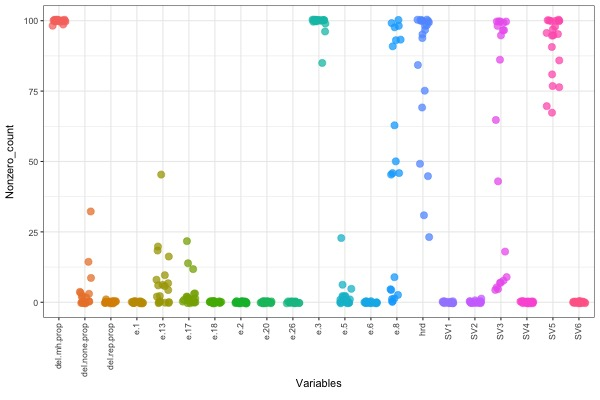
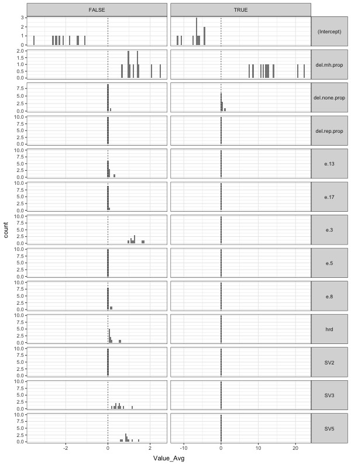
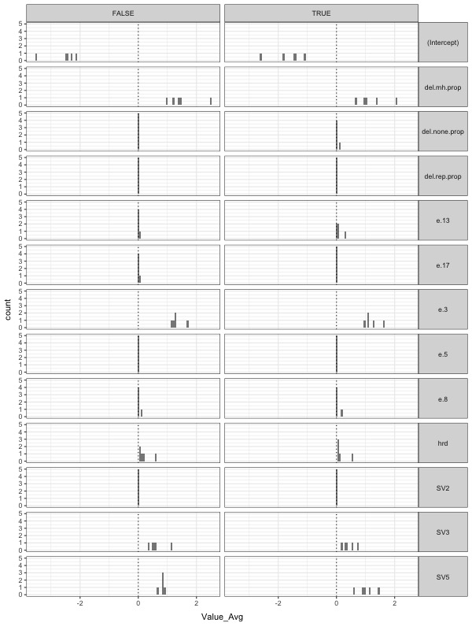
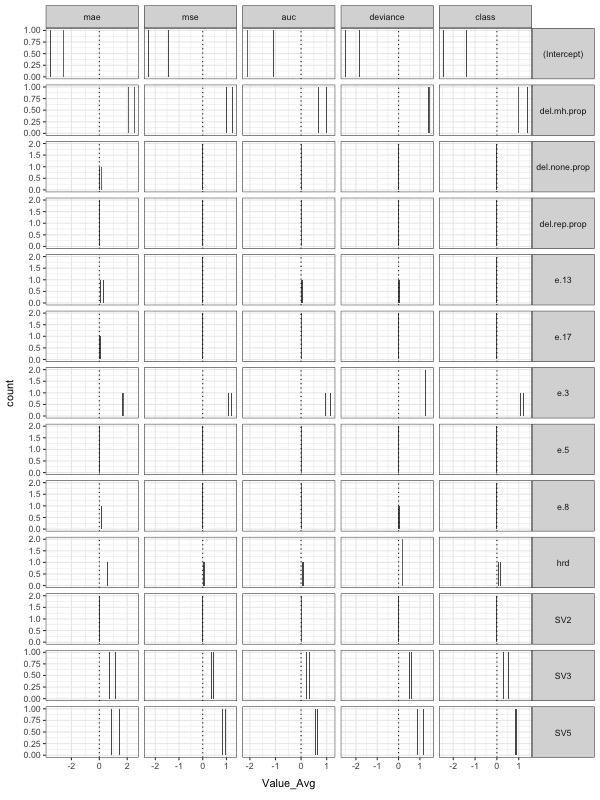
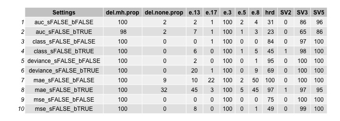
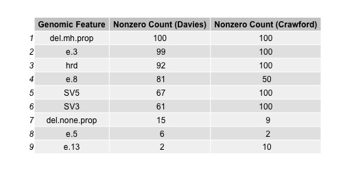
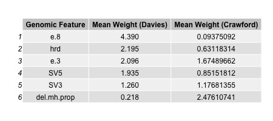
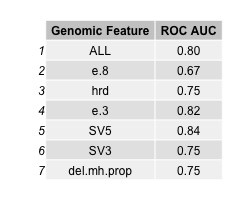
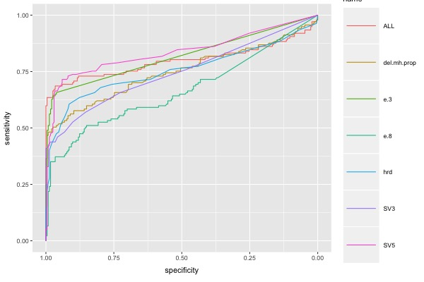

# Reproducing Davies et al. (_Nature Medicine_ 2017)

__Author__: David R. Crawford (drcbio@terpmail.umd.edu)  __Date__: November 05, 2018

## Note on Reproducing Plots and Tables
To reproduce, build conda environment using "environment.yml" and then run snakemake. After the __R__ packages have loaded (you'll see dialogue for this) the script takes a few minutes to run before it produces the 10 output files. The script take a few minutes because it is running 100 outer folds of 10 inner folds of cross-validation with __glmnet__ and it's doing this once for each of 20 different settings.

## Plan of Investigation
------

### Determine Relevant Genomic Features
The first goal is to reproduce findings presented in Supplementary tables 12 & 14.
This includes the stability analysis of genomic features (i.e. how often
is a feature assigned a non-zero coefficient across 100 cross-validation
runs?) and the determination of model weights to use for predictions.

#### Experiment
Train __cv.glmnet__ objects on the evaluation dataset (n=311) using different combinations of settings (cross-validation measure, standardization method, class balancing on/off).

#### Data, resources, and implementation
For this part I used the __R__ package referenced in Davies et al., __glmnet__
(Friedman et al. 2018).

This part is performed on data for the set of 77 _BRCA1_/_BRCA2_ carriers and 234 quiescent tumors.

Following Davies et al. 2017, with standardization done outside the __cv.glmnet__ call, the values are log normalized and then normalized to mean = 0 and SD = 1.
For these two normalization steps I used:
```
log_col = function(the_vector){
    the_vector1 = log(the_vector+1)
    return(the_vector1)
}
```
and
```
norm_col = function(the_vector){
    the_mean = mean(the_vector)
    the_sd = sd(the_vector)
    the_vector1 = the_vector-the_mean
    the_vector2 = the_vector1/the_sd
    return(the_vector2)
}
```

The outer folds divide the data into 10% for holdout validation and 90% for cross-validation.
For each outer fold, cross-validation is performed with 10 inner folds. I used the
following call for cross-validation:

```
cv.glmnet(x = train_mat, y = train_response, nfolds=10,
          lower.limits = 0, type.measure = "...",
          family = "binomial", standardize=...)
```
To force coefficients to be non-negative, __lower.limits__ is set to 0;
to optimize for AUC, __type.measure__ is set to either "auc", "mae", "mse", "class" or "deviance"; __family__ is set to"binomial"; and __standardize__ is set to TRUE or FALSE.


### Build AUC Plot for HRDetect
The second goal is to reproduce the ROC curves seen in Figure 4a.

#### Experiment
This involves plotting ROCs based on predictions from the trained __cv.glmnet__ object on the full dataset with n=371.

#### Data, resources, and implementation
The data is the same as for the first part, with the exception that another 60 cases are added to the 311 for a total of 371 cases. Implementation is the same as with the first part.


## Results, Conclusions, and Caveats
------
### Determine Relevant Genomic Features


##### Look at Nonzero_counts
The figure below shows for each of 21 genomic features how many times out of 100 cv_glmnet runs that feature had a nonzero coefficient. Each point represents that nonzero count for one of the 20 settings combinations (standarize + balance + measure)



We see that the six genomic features used by Davies et al. stand out---they have many
points near the top of the plot. For three of these, del.mh.prop, e.3, and SV5,
all points are above 50 and for del.mh.prop and e.3 all points are above 80-something.
For the other three features used by Davies et al., some settings give a nonzero count
near the top of the plot, but many also give counts nearer to or at the bottom of the plot.

As a table...


##### Look at coefficient values themselves
The set is trimmed down from 21 feature coefficients + intercept by removal of features with no positive coefficients, leaving 11 features.

###### Standardization
Here it is w/ standardization outside glmnet call (FALSE) or within glmnet call (TRUE). It looks like to get the order of magnitude for intercept and the 6 genomic features found by Davies et al. we should set standardization to FALSE. In other words, using __norm_col__ and __log_col__ (as defined above) to standardize the matrix _before_ the __cv.glmnet__ call gives better results than standardizing in the __cv.glmnet__ call by setting __standardize=TRUE__.



###### Balancing
Here it is with standardization==FALSE & with balancing T/F. It doesn't look like this is a big difference-maker.



###### Different Measures
Here it is with standardization==FALSE, across the 5 measures:



Now, coming back to the nonzero counts:



From this, it looks like [measure = mae, standardize = FALSE, balance = FALSE] is the only setting that results in higher (>=50) nonzero_count values for the exact set of features used by Davies et al.

So, returning to their supplementary tables, we get the following results. For Figure 12:



And, for the regression weights, for Figure 14:



So, the coefficients are not too similar, but the intercepts are similar (about -2.5).

### Build AUC Plot for HRDetect

It was not difficult to reproduce AUC plots as in Figure 4a, but the AUC for the full model was lower than found by Davies et al. My hunch is that in my case the model is overfitted to the 311 cases so that when run on the 371 cases it does quite poorly. In fact, seeing as 311/371 = 0.84 it's not surprising that the better ROC curves plateau at around 75% sensitivity. It's possible that my choosing the [measure="mae", standardize=FALSE, balance=FALSE] setting based on nonzero counts ended up giving me such different coefficients that I was unable to achieve a high AUC as Davies et al. did.

The AUC values are as follows (for all six features and for each singly):



The ROCs for all six features and for each singly:




## References
------
1. Davies, H., Glodzik, D., Morganella, S., Yates, L. R., Staaf, J., Zou, X.,
Ramakrishna, M., Martin, S., Boyault, S., Sieuwerts, A. M., Simpson, P. T., King, T. A.,
Raine, K., Eyfjord, J. E., Kong, G., Borg, A., Birney, E., Stunnenberg, H. G.,
van de Vijver, M. J., Borresen-Dale, A.-L., Martens, J. W. M., Span, P. N., Lakhani, S. R.,
Vincent-Salomon, A., Sotiriou, C., Tutt, A., Thompson, A. M., Van Laere, S.,
Richardson, A. L., Viari, A., Campbell, P. J., Stratton, M. R., Nik-Zainal, S.
(2017) "HRDetect is a predictor of _BRCA1_ and _BRCA2_ deficiency based on mutational
signatures." _Nature Medicine_ 23(4): 517-525. [doi: 10.1038/nm.4292](10.1038/nm.4292)
2. Friedman, J., Hastie, T., Tibshirani, R., Simon, N., Narasimhan, B., Qian, J. (2018) "Package 'glmnet'" CRAN v.2.0-16.
