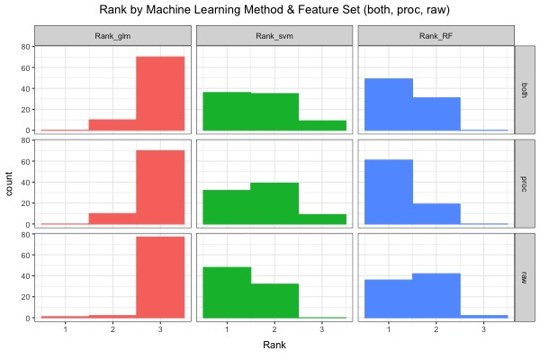

# Predicting BRCAness with Multiple Machine Learning Approaches (Revisiting Davies et al. 2017)

**Author**: David R. Crawford (drcbio@terpmail.umd.edu)
**Date**: December 7, 2018

## Plan of investigation

The goal for the experiment is to train machine learning models on the breast cancer data used by Davies et al. 2017 using accepted train/test/validate practices. Davies et al. validated their HRDetect model using the original training set plus 60 additional cases. This is contrary to the basic principle of validating a model with held-out data. A more appropriate approach would be to separate the data into a cross-validation set (say, 90%) and a final validation set (say, 10%). Under this approach, final validation consists in testing the model's performance (e.g. the Area Under the Receiver Operator Characteristic curve, AUROC) when applied to data _that was not used for model training or cross-validation_. In addition, this experiment will include steps to balance classes to avoid overestimating accuracy due to imbalanced classes (e.g. if 90% of cases are positive, achieving high accuracy is as easy as predicting positive for every case).

The experiment will involve training multiple-regression models, as done by Davies et al. and in my Project 1, and in training two additional model types, support vector machines (SVM) and random forests (RF). I will also run these models on raw and on processed data to see how data processing affects results. In this case processing refers to substituting mutation signature counts for 96-trinucleotide counts and likewise substituting 6 chromosomal rearrangement count groups for raw chromosomal rearrangement counts.

I suspect that RF and SVM will perform differently from (and potentially better than) GLM models since they work to identify classification boundaries within quantitative variables. Put in other words, these methods attempt to find dividing (classifying) lines within feature spaces instead of simply weighting and aggregating them.

### Experiment
I propose to run machine learning models on data from Davies et al. [1]. I depart from Davies et al. in three ways:
1. I will use a standard train/test/validate structure so that cross-validated models are tested with a holdout set. (One might call it a cross-validate/holdout division where cross-validate data is split into train/test sets.)
2. I will train models on the raw data, on the processed data, and on the combined raw and processed data. As in Project 1 I will also run with and without logarithmic transformation and with and without normalization. Running the analysis with raw data is a crucial baseline step missing from Davies et al. (2017)---before comparing the details of models learned on mutation signature counts we should see if trading raw mutation counts for mutation signature counts helpful.
3. In addition to generalized linear models (GLM), I will train random forest (RF) and support vector machine (SVM) models.

### Data, resources, and implementation

Data will be that used in Davies et al. [1]. The data will be obtained from the course UMIACS server folder for Davies 2017: 'https://obj.umiacs.umd.edu/mutation-signature-explorer/publications/Davies2017/processed/'. Individual file paths are listed in the __Snakefile__. Data files include:
* _add-feat_: mutation signature counts (11 signatures); chromosomal rearrangement counts (6 rearrangements); three indel signatures; homologous recombination deficiency index; two Boolean variables indicating control status and inclusion in Davies et al.'s evaluation.
* _counts-brca_: raw counts for mutations in each of 96 trinucleotide categories
* _sample-key_: key for linking different patient and sample ids
* _raw-counts_: raw counts for indel and rearrangement events

All analysis will be implemented in __R__. I will write my own code for data processing and analysis.
* Random forest analysis will be performed using the __randomForest__ package [4].
* Support vector machine analysis will be performed using the __caret__ package [5].
* Generalized linear model analysis will be performed using the __glmnet__ package [2], as done by Davies et al. [1] and in my Project 1.
* ROC analysis will be performed using the __pROC__ package [3].

We run 20 rounds to get a good number of rounds without taking too long when running on a typical laptop computer without explicit parallelization (and despite implicit parallelization---some utilities I use do in fact engage multiple cores when run on my laptop). The user can change the number of rounds by setting value for __num_runs__ at the top of "main_code.R".

#### Machine Learning Parameters
The following tables give machine learning parameters changed from their defaults.

##### Generalized Linear Model (GLM)
__cv.glmnet__

Measure type is "AUC" since the ultimate task here is maximizing AUROC. Family is set to binomial since this is a binary classification task. Standardize is set to FALSE since logarithmic transformation and normalization are done explicitly in the script using my own functions. Following Davies et al. [1], the coefficient lower limit is set to zero so that mutations, mutation signatures, etc., can contribute positively to classification but not negatively. (See their text for details.)

| Parameter                        | Setting           |
| -------------------------------- | ----------------- |
| lower.limits                     |  0              |    
| type.measure                     | "auc"             |            
| family                           | "binomial"        |                  
| standardize                      | FALSE             |     

__predict.glmnet__

Type is set to "response" to return linear predictors (i.e. probabilities between 0 and 1) for the classes.

| Parameter                        | Setting           |
| -------------------------------- | ----------------- |
| type                             | "response"        |  

##### Support Vector Machine (SVM)
__trainControl__

Method is set to "repeatedcv" for repeated cross-validation. Number and repeats are set to 5, as done in my Project 1 and in Davies et al. [1]. ClassProbs is set to TRUE to return classification probabilities (the same was done with GLM by setting "type" to "response").

| Parameter                        | Setting           |
| -------------------------------- | ----------------- |
|  method                          |  "repeatedcv"     |                  
|  number                          |   5               |                   
| repeats                          | 5                 |                  
| classProbs                       | TRUE              |                  
| summaryFunction                  | twoClassSummary   |                   
| savePredictions                  | TRUE              |

__train__

We use method "svmRadial" since it tends to perform the best out of the three options. A more thorough analysis would test the different methods for this particular application. Tunelength is set to 5 as this has been sufficient in past analyses (others I have performed; default is 3). Metric is set to "ROC" since our ultimate evaluation is in terms of AUROC. Verbose is set to FALSE to turn off status updates.

| Parameter                        | Setting           |
| -------------------------------- | ----------------- |
|  method                          |  "svmRadial"      |                 
| tuneLength                       | 5                 |  
| metric                           | "ROC"             |  
| verbose                          | FALSE             |

__predict__

We set type to "prob" to return classification probabilities we can use for AUROC calculations.

| Parameter                        | Setting           | Source            |
| -------------------------------- | ----------------- | ----------------- |
|  type                            |  "prob"           |   source          |

##### Random Forests (RF)
__predict__

We set type to "prob" tu return classification probabilities we can use for AUROC calculations. We set norm.votes so that classification probabilities are calculated as the fraction of random forests predicting a particular classification.

| Parameter                        | Setting           |
| -------------------------------- | ----------------- |
|  type                            |  "prob"           |                  
|  norm.votes                      |  TRUE             |

#### Validation

Validation of the models will consist in measuring AUROC values for model predictions when run on a held-out validation set. As noted above, the hold-out set will be determined at the outset so that model validation is carried out on data not used for training. While an AUC of 98% (as found in Davies et al.) is an unrealistic expectation with standard validation practices, the goal for BRCA-ness prediction will be a model AUC of >80%, with >90% considered a great success.

Critically, the different feature sets and machine learning models will be compared across the same set of random train/test/validate sample splits. Thus, direct ranking comparisons on a round-by-round basis are meaningful. Without this step, we might want to run more than 20 rounds to ensure large enough sample of train/test/validate splits for comparison across sets and methods.

## Results, conclusions, and caveats
Overall, RF and SVM models outperformed GLM models. We see this in the below violin plot as well as in the mean and rank tables below.

#### Overall AUC Comparison by Method
![plot1]](plot_1.jpg)

The plot below compares AUCs for each method across the three feature sets (raw, processed, both). We see that AUC values shift upwards for SVM and RF methods with processing, and that all three violins seem to slump downwards when models are run on both feature sets. As we see in the two tables below, performance for RF and GML improves when going from raw to processed features, but worsens when going from either feature set to both feature sets. In contrast, SVM performs slightly better on raw data than it does on processed data or combined data.

#### AUC Comparison by Feature Set

Below we see that normalization and log transformation tends to improve performance, but normalizing without log transforming hurts performance.
#### AUC Comparison by Normalization (T/F) (lower facet labels [FTFT]) and Logarithmic Transformation (T/F) (upper facet labels [FFTT]).

Below we see that GLM tends to rank quite low (1 is the best result, 3 is the worst) overall. With combined and processed data, RF outpeforms SVM, but with raw data SVM outperforms RF.

#### Rank by Method and Feature Set

These two tables provide mean AUCs and mean ranks shown in the above figures.
#### Mean AUCs

#### Mean Ranks

In conclusion, according to the validation criteria defined above, I find that both SVM and RF outperform GLM in the analyses. Importantly, performance on raw data (e.g. no signatures!) is only slightly lower than performance on processed data (a few % AUC), which calls into question the need to include mutation signature data as Davies et al. [1] have done. This does not, of course, preclude using a different set of signatures than that used by Davies et al.

## Future Directions

Additional steps would include:
1. Validation on additional data sets as Davies et al. [1] did.
2. Training on a different set of mutation signatures (using supervised NMF?) to see if performance would improve markedly over training on raw data.

## References

1. Davies, H., Glodzik, D., Morganella, S., Yates, L. R., Staaf, J., Zou, X.,
Ramakrishna, M., Martin, S., Boyault, S., Sieuwerts, A. M., Simpson, P. T., King, T. A.,
Raine, K., Eyfjord, J. E., Kong, G., Borg, A., Birney, E., Stunnenberg, H. G.,
van de Vijver, M. J., Borresen-Dale, A.-L., Martens, J. W. M., Span, P. N., Lakhani, S. R., Vincent-Salomon, A., Sotiriou, C., Tutt, A., Thompson, A. M., Van Laere, S.,
Richardson, A. L., Viari, A., Campbell, P. J., Stratton, M. R., Nik-Zainal, S.
(2017) "HRDetect is a predictor of _BRCA1_ and _BRCA2_ deficiency based on mutational
signatures." _Nature Medicine_ 23(4): 517-525. [doi: 10.1038/nm.4292](10.1038/nm.4292)
2. J. Friedman, T. Hastie, R. Tibshirani, N. Simon, B. Barasimhan, J. Qian (2018) "Package 'glmnet'. Lasso and Elastic-Net Regularized Generalized Linear Models." Version 2.0-16, 2018-03-12. CRAN:  https://CRAN.R-project.org/package=glmnet.
3. X. Robin, N. Turk, A. Hainard, N. Tiberti, F. Lisacek, J.-C. Sanchez, M. Muller, S. Siegbert (2018) "Package 'pROC'. Display and Analyze ROC Curves." Version 1.13.0, 2018-09-23. CRAN: https://CRAN.R-project.org/package=pROC.
4. L. Breiman, A. Cutler, A. Liaw, M. Wiener (2018) "Package 'randomForest'. Breiman and Cutler's Random Forests for Classification and Regression." Version 4.6-14, 2018-03-22. CRAN: https://CRAN.R-project.org/package=randomForest.
5. M. Kuhn (2018) "Package 'caret'. Classification and Regression Training." Version 6.0-81, 2018-11-20. CRAN:  https://CRAN.R-project.org/package=caret.
